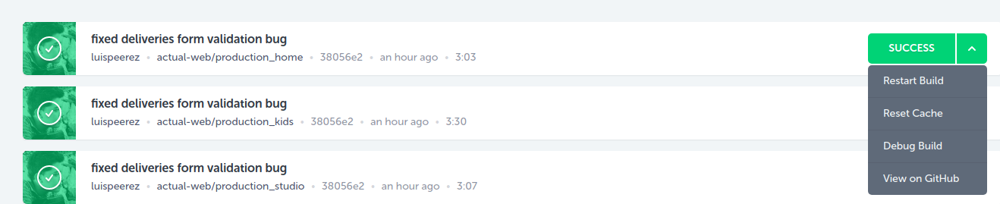

#Config codeship migrate from old node versions to node 8.x.x or higher

*In the tests section make sure your node version install has the new version, e.g:
	nvm install 8.9.4
	nvm use 8.9.4
	npm install

* Save your changes and before doing a build, reset your cache

* Make sure, the new npm node_modules folder is copied from codeship to your server.
